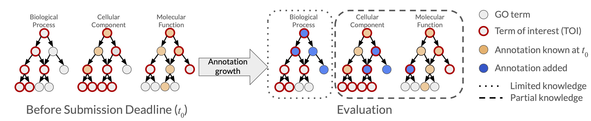

# CAFA-evaluator (CAFA4+ Edition)

This repo was branched from the [CAFA-evaluator](https://github.com/BioComputingUP/CAFA-evaluator) and additional functionality was added.
Visit the original [CAFA-evaluator Wiki](https://github.com/BioComputingUP/CAFA-evaluator/wiki) for more information about the algorithm.


The two main new functionalities are:
* **Flexible terms-of-interest**
  A file can be passed in with a list of ontology terms that will be evaluated for all proteins. Only terms included in the file
  will be evaluated. This can be used to exclude terms that were added to the ontology since predictions were collected or to
  exclude terms that have been deemed uninformative or for whatever reason should not be included in evaluation.  

  In the figure below, the terms of interest are shown with a red outline.
  These terms will be evaluated for _all proteins_ for which there are annotations in the ground truth file.
  
* **Protein-specific known annotations**
  To evaluate under the "Partial Knowledge" evaluation setting, any annotations known previous to prediction should be excluded from
  evaluation. This exclusion is done similarly to the terms-of-interst, but for each individual protein.
  
  In the figure below, the annotations are shown for a single protein. Terms with annotations known before the prediction phase are
  shown in yellow in the Cellular Component and Molecular Function aspects of the Gene Ontology. These terms should be excluded from
  evaluation. New annotations are shown to the right in blue. Evaluation should happen _only_ for these terms. If the newly annotated
  terms do not appear in the terms-of-interest file, they will not be evaluated.  

  A known-annotations file can be passed in for any evaluation setting and will not have and effect in No-Knowledge or Limited-Knowledge
  evaluation. For example in the figure below, if a known-annotations file is passed in with the terms in yellow listed, the Limited-Knowlege
  evaluation of the Biological Process (BP) aspect will produce the same results as if the file was not passed in at all. This is because
  there are no known terms in BP for this process and they will not appear in the known annotations file.

 


## Citation
Please cite the original CAFA Evaluator and, once available, the forthcoming CAFA 5 papers if you use this code in published research  
[CAFA-evaluator: A Python Tool for Benchmarking Ontological Classification Methods](https://doi.org/10.1093/bioadv/vbae043)  
*D Piovesan, D Zago, P Joshi, MC De Paolis Kaluza, M Mehdiabadi, R Ramola, AM Monzon, W Reade, I Friedberg, P Radivojac, SCE Tosatto*  
**Bioinformatics Advances (2024)** - DOI: [10.1093/bioadv/vbae043](https://doi.org/10.1093/bioadv/vbae043)

Crowdsourcing the fifth critical assessment of protein function annotation algorithms (CAFA 5) yields improvement in protein function prediction  
*TBD*  
**TBD** - DOI: TBD


## Usage

The program can be executing the command line interface or as a library.
Both the command line and the library accept the following positional arguments:

* **Ontology file** in OBO format

* _**NEW**_: **Terms of Interst file** contains term names that appear in the OBO file to be included in evaluation
  
* _**NEW**_: **Known annotations file** contains annotations known before the evaluation phase

* **Prediction folder** contain prediction files. Files can be organized into sub-folders, 
sub-folders are processed recursively and the sub-folder name is used as prefix for the method name

* **Ground truth file** containing targets and associated ontology terms

Example input files are provided inside the `data/example` folder. 

### Command line

When executed from the command line the script logs information about the calculation in the console (standard error) and
will create a folder named `results` containing the evaluation results. 
A different folder can be specified using the `-out_dir` option. 
 
The original CAFA-evaluator functionality works as before without additional imput arguments

```bashcon
python3 /path/to/CAFA-evaluator/src/cafaeval/__main__.py ontology_file prediction_folder ground_truth_file 
```

_**NEW**_: By default, all terms in the ontology will be considered in the evaluation. To include only specific terms, provide a terms-of-interest file
```bashcon
python3 /path/to/CAFA-evaluator/src/cafaeval/__main__.py ontology_file prediction_folder ground_truth_file -toi terms_of_interest_file
```

_**NEW**_: To evaluate Partial Knowledge annotations, the known annotations file must be passed in with the `-known` option.
```bashcon
python3 /path/to/CAFA-evaluator/src/cafaeval/__main__.py ontology_file prediction_folder ground_truth_file -known known_annotations_file
```

_**NEW**_: You can pass in both terms-of-interest and known annotations:
```bashcon
python3 /path/to/CAFA-evaluator/src/cafaeval/__main__.py ontology_file prediction_folder ground_truth_file -toi terms_of_interest_file -known known_annotations_file
```


## Input files
**Prediction file** - Tab separated file with the target ID, term ID and score columns.

~~~txt
A0A0A6YY25  GO:0010468  3.6396e-05
O54963	GO:0010033	0.0617
O54963	GO:1990841	0.035
X1WHY6	GO:0010033	0.1352
X1WHY6	GO:0048731	0.0478
...
~~~

**Ground truth file** - Tab separated file with the target ID and term ID. 
Additional columns are discarded.
~~~
A0A0A6YY25	GO:0009892	
A0A0A6YY25	GO:0010468
O54963	GO:1990841
O54963	GO:0010033
O88898	GO:1990841
X1WHY6	GO:0048609
X1WHY6	GO:0048731
...
~~~

**Information accretion file (optional)** - If not provided, the weighted and S statistics are not generated.
Information accretion (IA) can be calculated as described in
[Wyatt and Radivojac, Bioinformatics, 2013](https://pubmed.ncbi.nlm.nih.gov/23813009/) 
and implemented in [https://github.com/claradepaolis/InformationAccretion](https://github.com/claradepaolis/InformationAccretion)

```
GO:0009892	0.3286
GO:0010468	0.0184
GO:0008150  0
GO:1990841  3.1613
...
```

_**NEW**_: **Known annotations (optional)** - Tab separated file with target ID and term ID. 
File containing known annotations to exclude from partial-knowledge evaluation. 
If not provided, all terms will be used in evaluation

```
A0A009IHW8	GO:0072523
A0A009IHW8	GO:0046700
O54963	GO:0045596
O54963	GO:2000064
O54963	GO:0062014
...
```

_**NEW**_: **Terms of Interest (optional)** - File with term ID to include in evaluation for all proteins, one ID per line.  
If not provided, all terms will be used in evaluation. 
This file is used to specify terms that will be evaluated, usually used to exclude terms in the ontology that have since
been obsoleted or are not of interest for the evaluation.

```
GO:0055039
GO:0072523
GO:0003882
GO:0010139
...
```

## Output files

Output files are generated in the `results` folder. The same files are gerated by both
the command line and the `write_results` function.

* `evaluation_all.tsv` corresponds to the first object returned by the `cafa_eval` function.
* `evaluation_best_< metric >.tsv` corresponds to the second object returned by the `cafa_eval` function. 
A different file for each metric is created.

**Note**: Weighted scores are generated only if the *Information Accretion* file is provided.


## Optional parameters

|  Argument   | Default value | Description                                                                                                                                                                                                                                                               |
|:-----------:|------------|---------------------------------------------------------------------------------------------------------------------------------------------------------------------------------------------------------------------------------------------------------------------------|
|  -out_dir   |   'results' | Output directory (tsv files + log). Either relative to current path or absolute                                                                                                                                                                                           |
|     -ia     |            | Information accretion file                                                                                                                                                                                                                                                |
|   -known    |            | Known annotations for each protein that should be excluded in partial-knowledge evaluation                                                                                                                                                                               |
|    -toi     |            | Terms of interest file   (terms considered for all proteins)                                                                                                                                                                                                              |
| -no_orphans |  False (flag) | Exclude orphans nodes (e.g. roots) from the calculation                                                                                                                                                                                                                   |
|    -norm    |     'cafa'  | Normalization strategy. `cafa` normalize precision by the number of predicted targets and recall by the number of targets in the ground truth. `pred` normalize by the number of  predicted targets. `gt` normalize by the number of ground truth proteins                |
|    -prop    |     'max'  | Ancestor propagation strategy. `max` propagate the max score of the traversed subgraph iteratively. `fill` propagate with max until a different score is found                                                                                                            |
|  -th_step   |      0.01  | Step size of prediction score thresholds to consider in the range [0, 1). A smaller step, means more calculation                                                                                                                                                          |
| -max_terms  |            | Number of terms for protein and namespace to consider in the evaluation. Parsing stops when the target limit for every namespace is reached. The score is not checked, meaning that terms are not sorted before the check, and the check is performed before propagation. |
|  -threads   |       4    | Parallel threads. `0` means use all available CPU threads. Do not use multi thread if you are short in memory                                                                                                                                                             |

